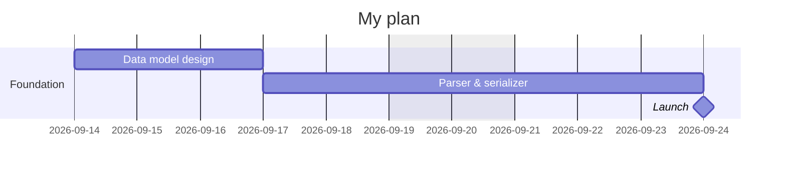

# Gantt Planner — file format

A plan is **one markdown file** with two parts:
1. A ` ```mermaid ` block with a `gantt` chart → the **schedule**.
2. `## Task metadata: <id>` blocks → the **context** behind each task.

They're linked by the task **id**.

## Example

````markdown


## Task metadata: arch1

- type: architecture
- owner: Jonas

Decide the data model, layers, and coordinate math.
This unblocks the parser — see the [design notes](https://example.com).
**Open question:** do we support sub-day durations in v1?
````

## Schedule syntax

**Directives** (inside the block):

| Line | Meaning |
|---|---|
| `title <text>` | Chart title (optional) |
| `dateFormat YYYY-MM-DD` | Required; only this format is supported |
| `section <name>` | Groups the task lines that follow |
| `excludes weekends` | Skip weekends in scheduling (optional) |

**Task line:**
```
<Label> : [milestone,] <id>, <position>, <duration>
```
- **Label** — any text (shown on the bar).
- **milestone** — optional leading tag; renders as a milestone. (`done`/`active`/`crit` are accepted but ignored.)
- **id** — required, unique. Used for dependencies and to link metadata.
- **position** — either an absolute date `YYYY-MM-DD`, or `after <id> [<id>…]` (starts after the latest-ending predecessor).
- **duration** — `<n>d`, in 0.5-day steps (`0.5d`, `3d`, `4.5d`; `0d` for milestones).

## Metadata blocks — the context behind a task

This is where a plan stops being a chart and becomes a document. The schedule
says *when*; the metadata block says *what, why, and what's unresolved*.

- Heading: `## Task metadata: <id>` — the id must match a task. Optional; a task
  with no block is fine.
- **The free markdown is the heart of it.** Everything below the key list is
  rich context — the rationale, notes, decisions, links, and open questions that
  give the task meaning. It's shown in the hover card and supports `**bold**`,
  `*italic*`, `` `code` ``, `[links](https://…)`, lists, and headings. Write as
  much as the task deserves; this is where the value lives.
- **The keys are lightweight tags for filtering and reference.** Start the block
  with a `- key: value` list. Keys are free-form (`type`, `owner`, `team`,
  `priority`…) and let you **color/filter bars** by a chosen key. A missing key
  = "None". Keep them short — they organize tasks; they don't describe them.

```markdown
## Task metadata: dev1

- type: development     ← keys: filter & color
- owner: Jonas

Free markdown below ← the real content: context, reasoning, links, questions.
```

## Relations at a glance

```
task id  ─┬─►  after <id>                 (dependencies between tasks)
          └─►  ## Task metadata: <id>      (context + filter keys)
```

The id is the single link: one bar, its dependencies, and its context all share it.
