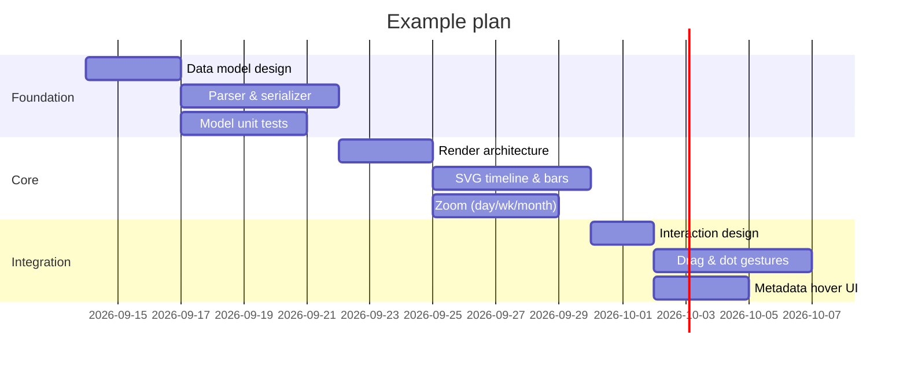

# Example plan — 3 sections × 3 tasks

Each task's metadata lives in a `## Task metadata: <id>` block below, keyed by the task id.
The whole block is free-form **markdown**, rendered as-is in the hover card. A leading
`- key: value` bullet run is also read by the viewer for render decisions — bars are colored
by the `type` key. Missing keys are treated as None.

## Task metadata: arch1

- type: architecture
- owner: Jonas
- team: Design

Lock the **Mermaid+metadata** format and the *task-ID* rule.

## Task metadata: dev1

- type: development
- owner: Jonas
- team: Core

`tokenizer` + canonical `serializer`; drives the **render gate**.

## Task metadata: dev2

- type: development
- owner: Alex
- team: Core

Tests for:
- parse errors
- round-trip
- ID stability

## Task metadata: arch2

- type: architecture
- owner: Jonas
- team: Design

Decide SVG structure, layers, coordinate math.
See [SVG spec](https://developer.mozilla.org/docs/Web/SVG).

## Task metadata: dev3

- type: development
- owner: Sam
- team: Frontend

Draw timeline grid, section rows, task bars.

## Task metadata: dev4

- type: development
- owner: Sam
- team: Frontend

Day/week/month tick generation and zoom switch.

## Task metadata: arch3

- type: architecture
- owner: Jonas
- team: Design

Bar-zone semantics and dot-connector gesture spec.

## Task metadata: dev5

- type: development
- owner: Alex
- team: Frontend

Pointer-event drag, cascade, dependency editing. **Blocked on** `arch3`.

## Task metadata: dev6

- type: development
- owner: Sam
- team: Frontend

Floating-UI hover card — now renders the metadata block's markdown.
